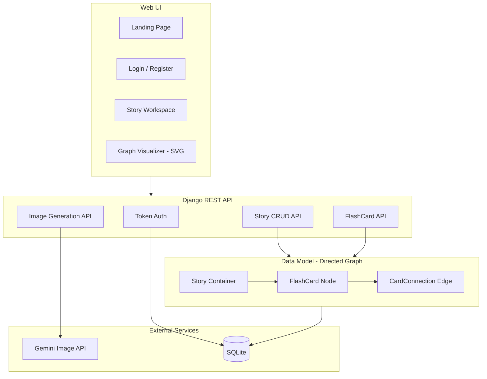

# StoryScape 📖✨

[](https://github.com/krishnakumarbhat/StoryScape/actions/workflows/ci.yml)
[](https://python.org)
[](https://www.django-rest-framework.org/)

StoryScape is a **story-graph backend** with a responsive landing UI, token-based authentication, branching story nodes, and optional Gemini AI image generation. Build interactive, branching narratives as directed graphs.

## 🏗️ Architecture



## 💡 Key Concepts

**Story Graph Model** — Each story is a directed graph:

- `Story` = container
- `FlashCard` = node (text + image)
- `CardConnection` = edge (`source_card → target_card`)

This enables **multiverse branching** — a single story point can fork into multiple narrative paths.

## 🛠️ Tech Stack

| Component        | Technology                       |
| ---------------- | -------------------------------- |
| Backend          | Django + Django REST Framework   |
| Database         | SQLite (default)                 |
| AI Pipeline      | LangGraph (optional)             |
| Retrieval        | LlamaIndex + ChromaDB (optional) |
| Image Gen        | Gemini API (optional)            |
| Auth             | Token-based (DRF)                |
| Containerization | Docker + Docker Compose          |

## 🚀 Quick Start

### Local Development

```bash
# Install dependencies
pip install -r requirements.txt

# Configure environment
cp env.example .env

# Run migrations and start server
python manage.py migrate
python manage.py runserver
```

Open `http://127.0.0.1:8000/`

### Seed Demo Data

```bash
python manage.py seed_dummy_story
```

### Docker

```bash
docker compose up --build
```

## 🔌 API Endpoints

### Auth

| Method | Endpoint              | Description       |
| ------ | --------------------- | ----------------- |
| POST   | `/api/auth/register/` | Register new user |
| POST   | `/api/auth/token/`    | Get auth token    |
| GET    | `/api/auth/profile/`  | Get user profile  |

### Stories

| Method | Endpoint                    | Description                     |
| ------ | --------------------------- | ------------------------------- |
| GET    | `/api/stories/`             | List all stories                |
| POST   | `/api/stories/`             | Create story                    |
| GET    | `/api/stories/{id}/graph/`  | Get story graph (nodes + edges) |
| DELETE | `/api/stories/{id}/delete/` | Delete story                    |

### FlashCards

| Method | Endpoint                               | Description       |
| ------ | -------------------------------------- | ----------------- |
| POST   | `/api/stories/{id}/flashcards/`        | Add card to story |
| PUT    | `/api/flashcards/{id}/`                | Update card       |
| POST   | `/api/flashcards/{id}/generate-image/` | AI image gen      |

## 🎨 Web UI

- `/` — Landing page
- `/login/` — Login page
- `/register/` — Registration
- `/app/` — Story workspace with visual graph viewer

Guest mode allows up to 5 stories per browser session without login.

## 🖼️ Gemini Image Generation

Set environment variables in `.env`:

```env
GEMINI_API_KEY=your_key
GEMINI_IMAGE_MODEL=gemini-2.0-flash-exp
```

Falls back to placeholder images if API is unavailable.

## 📁 Project Structure

```
StoryScape/
├── stories/              # Story app (models, views, serializers)
├── users/                # User app (auth, profiles)
├── storyscape/           # Django project settings
├── templates/            # HTML templates
├── static/               # CSS, JS, assets
├── manage.py
├── requirements.txt
├── Dockerfile
├── docker-compose.yml
├── .github/workflows/    # CI/CD pipeline
└── README.md
```

## 📝 License

MIT License
